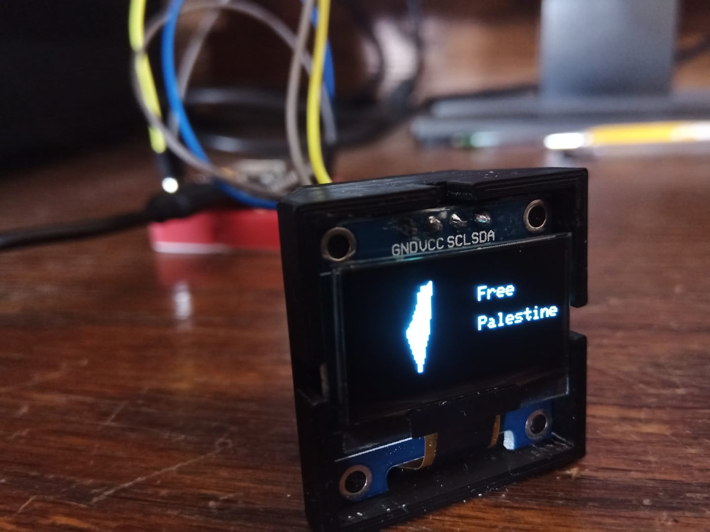

# Palestine Map

PlatformIO project to print Palestinian Map using OLED Display 128*64.  

### To run it using Arduino IDE:
1. Copy the code inside main.cpp to Arduino IDE.
2. Save the sketch.
3. Copy PalestineMap.h to the same directory of the sketch. (Sketch --> Show Sketch Folder)
4. Install Arduino libraries:
    - Adafruit GFX
    - Adafruit BusIO
    - Adafruit SSD1306
5. Compile and run the sketch.

* For Wiring, Check the MCU's default I2C pins, and refer to [Adafruit SSD1306](https://github.com/adafruit/Adafruit_SSD1306) library.

